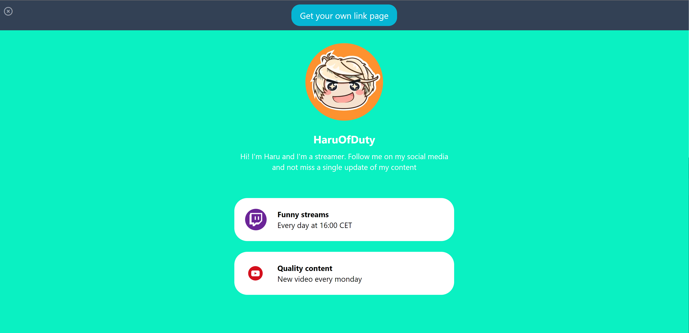
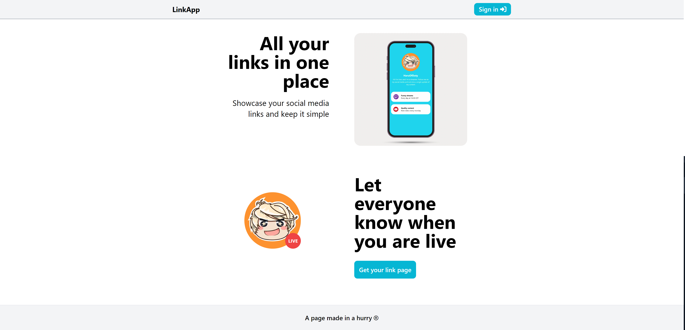

LinkApp is a project to have all your social links in one place. It is developed with [Next.js](https://nextjs.org/) so it doesn't need a dedicated server.




## Getting Started
Fork this repo and clone it in to your local environment.

Navigate to the project folder.

Run `npm install`.

To run the development server:

```bash
npm run dev
# or
yarn dev
# or
pnpm dev
```

Open [http://localhost:3000](http://localhost:3000) with your browser to see the landing page.

[API routes](https://nextjs.org/docs/api-routes/introduction) can be accessed on `http://localhost:3000/api/`. The endpoints can be edited in `pages/api/` folder.

Controllers, models and the database connection are inside `pages/api/server/` folder.

## Things to improve
Because this project has been developed in only one week it has some flaws to fix:
### Urgent
- At this moment, any user can create a link page with a `pageid` that already exists. The database allows it and it shouldn't.
- Error handling in the server side should be more clear.
- At this moment users can be created without storing a password. The `UserSchema` should bemodified to be able to store a hashed password.
- Nextjs provides `next/image` object that makes more efficient loading images. Due to an error with `src`'s that are from outside of the domain, `` tag is being used in some places. Find the solution to be able to use `next/image`
- Responses type in the server side are not very consistent. Sometimes return `payload`, sometimes return `message`. Design a solution for a more consistent typing.
- In `getServerSideProps` functions, when fetching data, the request is made to a hardcoded URL `https://localhost:3000`. Find a way to make it dynamic so when the app is deployed it works.

### Not so urgent
- Along all the app there are oportunities to modularize components. For example, an `InputText` component could be created because it repeats in many places.
- A refactor for `apiService.ts` would be beneficial. Abstract the shared logic for the api call to make it clearer and shorter.
- There is no custom error page
- `/users/[username]/profile` can be navigated but there is nothing there. A "Site under construction" sign would be nice.
- TEST COVERAGE: there is not a single test in all the app.
- There is almost no form validation in `register`, `login` and `edit` pages.
- Create a `.env` file that contains the database data, routes, etc.

### Tiny details
- User profile `dropDownMenu` in the `edit` page falls behind the preview box when is open.
- There are several buttons in the page that doesn't have hover feedback.
- The LinkApp logo in the navbar is not a link to the landing page.

### New features
- User authentication and a proper login
- Sessions. Persist data when reloading the page. Right now if the `edit` page is reloaded throws an error.
- Include some animations when adding, removing, changing thins on the app.
- Proper design system with dark mode.
- Responsive design.
- Load images for avatar and links from file system.
- Sort links in edit page with drag&drop functionality.
- Allow to put a background image instead of a color.
- Allow background color to be a fade.
- Show when the user is livestreaming by integrating with YouTube and Twitch APIs
- Implement user profile page and allow the user to change their data.
- Add email confirmation when register.
- Implement the analytics page to show how many people is clicking the page, location, gender and age. Today, last 30 days, last 6 months, last year, lifetime.
- Integrate with Stripe and make some of the features premium.
- Allow users to deploy their own linkpage on their own domain.

This are some ideas of what is missing in the app. Feel free to add more and ~~crosscheck~~ the ones that you complete.

## Learn More

To learn more about Next.js, take a look at the following resources:

- [Next.js Documentation](https://nextjs.org/docs) - learn about Next.js features and API.
- [Learn Next.js](https://nextjs.org/learn) - an interactive Next.js tutorial.

You can check out [the Next.js GitHub repository](https://github.com/vercel/next.js/) - your feedback and contributions are welcome!

## Deploy on Vercel

The easiest way to deploy your Next.js app is to use the [Vercel Platform](https://vercel.com/new?utm_medium=default-template&filter=next.js&utm_source=create-next-app&utm_campaign=create-next-app-readme) from the creators of Next.js.

Check out our [Next.js deployment documentation](https://nextjs.org/docs/deployment) for more details.
